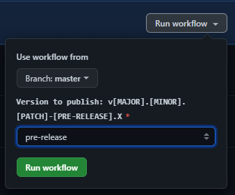

<div align="center">
    
    <h3>NestJS Package Starter</h3>
</div>

<p align="center">
    
    
    
    <br/>
    
    
    
    
    <br/> 
</p>

## Glosario

- [📝 Requerimientos básicos](#basic-requirements)
- [🙌 Let's start](#lets-start)
- [📦 Instalar dependencias](#install-dependencies)
- [💻 Scripts](#scripts)
- [🛠️ Build and Publish](#build-and-publish)
- [🔀 Workflows](#workflows)
- [📤 Commits](#commits)
- [📜 License MIT](license.md)

---

> 💬 Este repositorio cuenta con una configuración base para **GitHub Actions**, **Codecov** y **SonarCloud**, las cuales se pueden remover fácilmente del proyecto o bien, terminar de configurarlas para aprovechar al maximo las buenas prácticas.

<a name="basic-requirements"></a>

## 📝 Requerimientos básicos

- Node.js v14.15.4 or higher ([Download](https://nodejs.org/es/download/))
- NPM v6.14.10 or higher
- NestJS v8 or higher ([Documentación](https://nestjs.com/))
- Cuenta en NPM y/o YARN

<a name="lets-start"></a>

## 🙌 Let's start

Con el botón **Use this template**, creamos un repositorio nuevo en nuestro **GitHub** copiando todos los archivos del
repositorio original, y luego hacemos un `git clone` del mismo.

También podés ejecutar el siguiente script cambiando el nombre de destino

```
git clone https://github.com/rudemex/nestjs-package-starter.git <nombre-de-destino>
```

Example:

```
git clone https://github.com/rudemex/nestjs-package-starter.git my-awesome-package
```

Una vez clonado el repositorio, tenemos que cambiar el `name` del archivo `package.json`, ya que este va a ser el nombre
del paquete a generar.

```json
{
  ...,
  "name": "nestjs-package-starter",
  ...
  "name": "my-awesome-package",
  ...
}
```

> 💬 También podés ajustar otras propiedades como el **author**, **description**, **keywords**, etc.

<a name="install-dependencies"></a>

## 📦 Instalar dependencias

Estando en la carpeta del proyecto, instalamos sus dependencias con el script.

```
 npm install
```

<a name="scripts"></a>

## 💻 Scripts

### Inicia los test con coverage

```
npm run test
```

### Eslintea el código

```
npm run lint
```

### Realiza el build del paquete

Los builds se hacen con una herramienta llamada `@pika/pack` que por debajo usa `rollup`, una vez que el build se
realizó, vas a encontrar el contenido generado en la carpeta `./pkg` que contiene los diferentes builds, hasta el
`package.json` con las referencias a los módulos generados.

```
npm run build
```

Para probar localmente el paquete antes de publicarlo, podés utilizar el comando `npm link` estando dentro de la
carpeta `./pkg`, y luego linkearlo en tu proyecto para probarlo. [más info](https://medium.com/@AidThompsin/how-to-npm-link-to-a-local-version-of-your-dependency-84e82126667a)

```
cd ./pkg
npm link

npm link <name-of-package-json>

npm unlink <name-of-package-json>
```

### Realiza el build del paquete y actualiza la version.

```
npm version <tag>
// npm version v1.2.3
```

### Publicar paquete

```
npm publish
```

<a name="build-and-publish"></a>

## 🛠️ Build and Publish

Existen varias maneras para publicar el paquete en **npm**.

#### Sencilla y rápida

La manera más sencilla y rápida de publicar el paquete es ejecutar el script de `build` y luego ir dentro de la carpeta
`./pkg` y ejecutar el script de `publish`.

```
npm run build
cd ./pkg
npm publish
```

> 💬 Podés reemplazar `npm publish` por `yarn publish`, y publicar el paquete tanto en **npm** como **yarn**

#### La manera más óptima

Consiste en ejecutar el script de `version` con el tag correspondiente a desplegar, siguiendo la
[sintaxis de versionado](https://docs.npmjs.com/about-semantic-versioning). Con esta forma, se actualiza automáticamente
la version del `package.json`, y solo queda pushear al repositorio los cambios generados.

```bash
npm version v1.0.1
cd ./pkg
npm publish

git push
```

#### Automatizada

En la carpeta `.github/workflows` se encuentra los procesos automatizados para **GitHub Actions**, en esta se encuentra
el pipeline para el publish, el cual realiza todos los pasos correspondientes de manera automatizada para compilar el
paquete, publicarlo y versionar el repositorio con solo ingresar manualmente la version a desplegar, pero para
poder utilizar este método, es importante configurar los workflows que se detalla a continuación.



<a name="workflows"></a>

## 🔀 Workflows (GitHub Actions)

Para poder hacer uso de los **workflows** que contiene este repositorio, primero debes generar los **tokens**
correspondientes, o bien eliminar los procesos de los mismos.

En los siguientes links, vas a encontrar toda la documentación para obtener los **tokens** de cada aplicación, que luego
tendrás que configurarlo en los **secrets** en el repositorio. [Configurar Secret](https://sergiodxa.com/articles/github-actions-npm-publish#configure-the-secret)

#### Secrets

- `CODECOV_TOKEN` [Documentación Codecov.io](https://github.com/codecov/codecov-action)
- `SONAR_TOKEN` [Documentación SonarCloud](https://github.com/SonarSource/sonarcloud-github-action)
- `NPM_TOKEN` [Documentación NPM](https://snyk.io/blog/github-actions-to-securely-publish-npm-packages/)
- `GH_TOKEN` [Documentación GitHub](https://docs.github.com/en/authentication/keeping-your-account-and-data-secure/creating-a-personal-access-token)

<a name="commits"></a>

## 📤 Commits

Para los mensajes de commits se toma como
referencia [`conventional commits`](https://www.conventionalcommits.org/en/v1.0.0-beta.4/#summary).

```
<type>[optional scope]: <description>

[optional body]

[optional footer]
```

- **type:** chore, docs, feat, fix, refactor (más comunes)
- **scope:** indica la página, componente, funcionalidad
- **description:** comienza en minúsculas y no debe superar los 72 caracteres.

---

<div align="center">
    <a href="mailto:mdelgado@tresdoce.com.ar" target="_blank" alt="Send an email">
        
    </a><br/>
    <p>Made with ❤</p>
</div>
